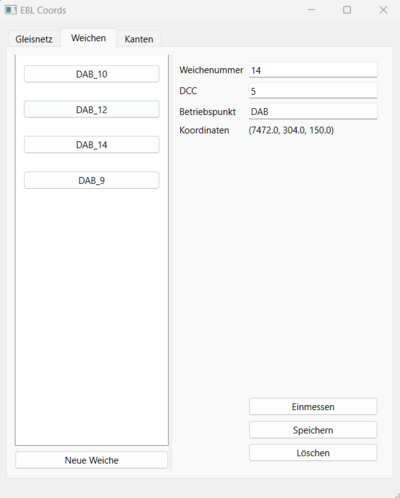
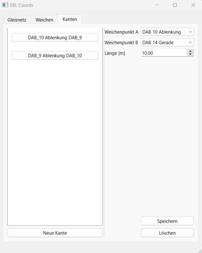
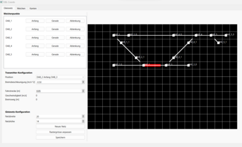

# Bedienungsanleitung EBL Coords
## Setup
Führe ebl_coords.exe im Ordnder, wo ebl_config.json liegt, aus.
## Streckenelemente erfassen
## Weiche
### Neue Weiche erfassen
- Auf den Knopf 'neue Weiche' klicken
- Folgende Werte eingeben:
    - Weichennummer
    - DCC (wie im ECoS)
    - Betriebspunkt (DAB, BLO, FUS etc.)
- 'Speichern' drücken

### Weiche einmessen
- Gewünschte Weiche aus der Liste selektieren
- Transmitter auf die dazugehörige Weichenzunge auf der Betriebsanlage stellen
- Prüfen ob Signal bei GTCommand ankommt (sieht man den Messwagen im GTCommand auf der Anlage?)
- In EBL Coords auf den Knopf 'Weiche einmessen' klicken
- Warten bis fertig eingemessen ist
- Transmitter entfernen
## Kante
### Neue Kante erfassen
- In den zwei Dropdown Listen die zwie passenden Elemente selektieren, welche mit einer Strecke verbunden werden sollen. (Bild Kante erfassen)
- Distanz angeben (kann im GIS gemessen werden)
- 'Speichern' klicken

## Netzplan
### Netzplan erstellen
- 'Netzhöhe' und 'Netzbreite' wählen
- Auf 'Neues Netz' klicken (Leeres Raster)
- In der 'Weichenpunkte' Liste auf den Knopf eines Topologie Punktes klicken
- Im Raster klicken, wo man den Topologie Punkt platzieren will
- Vorhandene Strecken werden automatisch verbunden
- Auf 'Speichen' klicken

### Zug fahren lassen
- In der Dropdown-Liste 'Position' selektieren auf welcher Strecke sich der Zug befindet (Richtung ist hier wichtig, Weiche 1 Ablenkung Weiche 2 bedeutet er fährt auf Weiche 2 zu).
- Zug fahren lassen
- Wenn Ortung verloren geht mit der Dropdown-Liste 'Position' die aktuelle Position des Zuges selektieren und weiterfahren
