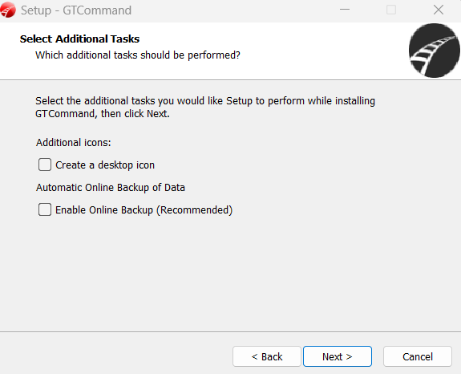
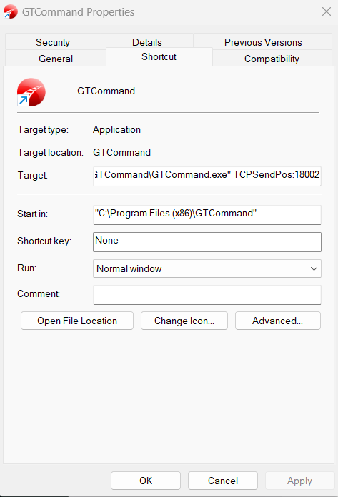

# GtCommand Setup

- Benutze den folgenden Installer: `GTCommandSetup_5.1.4.0.exe`
- Belasse immer den Standard, ausgenommen: 

Deaktiviere Online Backup

- Wieder überall den Standard, bis zur erfolgreich abgeschlossenen Installation.

## Produkt aktivieren
- Kopiere den Lizenschlüssel: `APUQRPZ004065KSCABQ3`
- Kopiere den Registrierungschlüssel: `2UG`

## Schienensystem laden
Im Menü: File -> Load System -> `EBL 14Sat.got`

## TCP aktivieren
- Gehe auf die Verknüpfung `GTCommand`
- Rechtsklick -> `Properties`
- Ergänze das `Target` Feld mit: ` TCPSendPos:18002`

# Zusätzliche Dokumentation
- `documents/GOT-DE.pdf`
- `documents/GOT-EN.pdf`
- `documents/GT-Position_IP_interface_setup.pdf`

